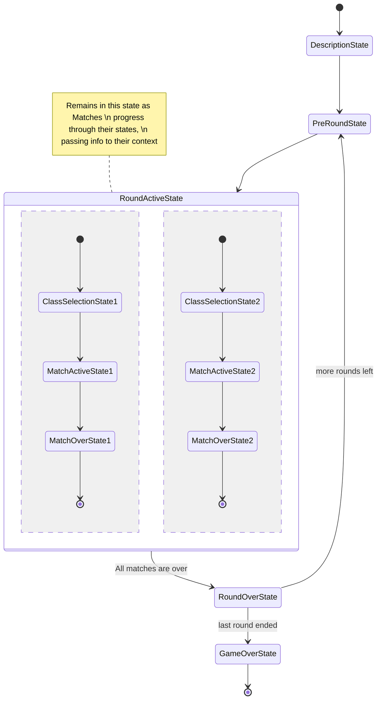

```mermaid
stateDiagram-v2
direction TB
classDef delay fill:orange,color:black
[*] --> DescriptionState
DescriptionState --> PreRoundState
PreRoundState --> RoundActiveState

state RoundActiveState {
    [*] --> ClassSelectionState1
    ClassSelectionState1 --> MatchActiveState1
    MatchActiveState1 --> MatchOverState1
    MatchOverState1 --> [*]
    --
    [*] --> ClassSelectionState2
    ClassSelectionState2 --> MatchActiveState2
    MatchActiveState2 --> MatchOverState2
    MatchOverState2 --> [*]
}
note left of RoundActiveState : Remains in this state as Matches \n progress through their states, \n passing info to their context 

RoundActiveState --> RoundOverState: All matches are over


RoundOverState --> PreRoundState: more rounds left
RoundOverState --> GameOverState: last round ended
GameOverState --> [*]
```
