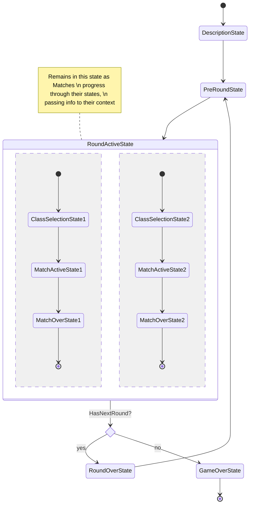

```mermaid
stateDiagram-v2
    direction TB
    classDef delay fill:orange,color:black
    [*] --> DescriptionState
    DescriptionState --> PreRoundState
    PreRoundState --> RoundActiveState

    state RoundActiveState {
        [*] --> ClassSelectionState1
        ClassSelectionState1 --> MatchActiveState1
        MatchActiveState1 --> MatchOverState1
        MatchOverState1 --> [*]
        --
        [*] --> ClassSelectionState2
        ClassSelectionState2 --> MatchActiveState2
        MatchActiveState2 --> MatchOverState2
        MatchOverState2 --> [*]
    }
    note left of RoundActiveState : Remains in this state as Matches \n progress through their states, \n passing info to their context

    state HasNextRound <<choice>>
    RoundActiveState --> HasNextRound: HasNextRound?
    HasNextRound --> RoundOverState: yes
    RoundOverState --> PreRoundState

    HasNextRound --> GameOverState: no

    GameOverState --> [*]
```
