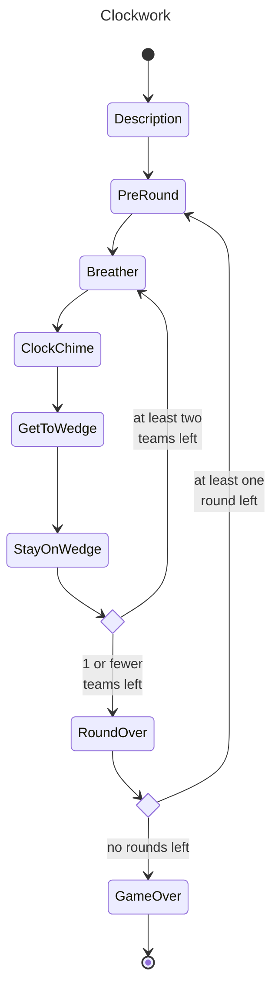

```mermaid
---
title: Clockwork
---
stateDiagram-v2


[*] --> Description
Description --> PreRound
PreRound --> Breather
Breather --> ClockChime
ClockChime --> GetToWedge
GetToWedge --> StayOnWedge

state teams_left <<choice>>
StayOnWedge --> teams_left
teams_left --> Breather: at least two<br>teams left
teams_left --> RoundOver: 1 or fewer<br>teams left

state rounds_left <<choice>>
rounds_left --> GameOver: no rounds left
GameOver --> [*]

RoundOver --> rounds_left
rounds_left --> PreRound: at least one<br>round left
```
