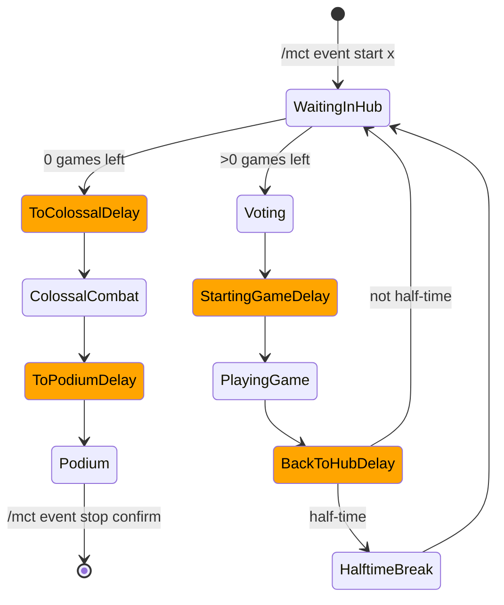

```mermaid
stateDiagram
direction TB
classDef delay fill:orange,color:black

[*] --> WaitingInHub: /mct event start x
WaitingInHub --> ToColossalDelay: 0 games left
ToColossalDelay--> ColossalCombat
ColossalCombat --> ToPodiumDelay
ToPodiumDelay --> Podium
Podium --> [*]: /mct event stop confirm

WaitingInHub --> Voting: >0 games left
Voting --> StartingGameDelay
StartingGameDelay --> PlayingGame
PlayingGame --> BackToHubDelay
BackToHubDelay --> WaitingInHub: not half-time
BackToHubDelay --> HalftimeBreak: half-time
HalftimeBreak --> WaitingInHub

class ToColossalDelay, ToPodiumDelay, StartingGameDelay, BackToHubDelay delay
```