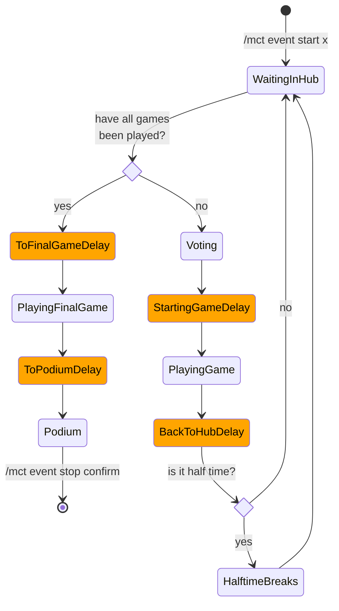

```mermaid
stateDiagram
direction TB
classDef delay fill:orange,color:black

[*] --> WaitingInHub: /mct event start x
state games_left <<choice>>
WaitingInHub --> games_left: have all games<br>been played?
games_left --> ToFinalGameDelay: yes
ToFinalGameDelay --> PlayingFinalGame
PlayingFinalGame --> ToPodiumDelay
ToPodiumDelay --> Podium
Podium --> [*]: /mct event stop confirm

games_left --> Voting: no
Voting --> StartingGameDelay
StartingGameDelay --> PlayingGame
PlayingGame --> BackToHubDelay
state half_time <<choice>>
BackToHubDelay --> half_time: is it half time?
half_time --> HalftimeBreaks: yes
half_time --> WaitingInHub: no
HalftimeBreaks --> WaitingInHub

class ToFinalGameDelay, ToPodiumDelay, StartingGameDelay, BackToHubDelay delay
```