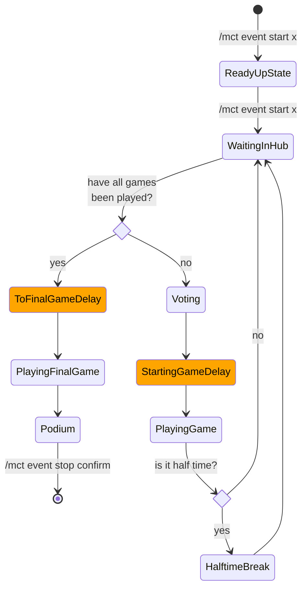

```mermaid
stateDiagram
direction TB
classDef delay fill:orange,color:black

[*] --> ReadyUpState: /mct event start x
ReadyUpState --> WaitingInHub: /mct event start x
state games_left <<choice>>
WaitingInHub --> games_left: have all games<br>been played?
games_left --> ToFinalGameDelay: yes
ToFinalGameDelay --> PlayingFinalGame
PlayingFinalGame -->  Podium
Podium --> [*]: /mct event stop confirm

games_left --> Voting: no
Voting --> StartingGameDelay
StartingGameDelay --> PlayingGame
state half_time <<choice>>
PlayingGame --> half_time: is it half time?
half_time --> HalftimeBreak: yes
half_time --> WaitingInHub: no
HalftimeBreak --> WaitingInHub

class ToFinalGameDelay, StartingGameDelay delay
```