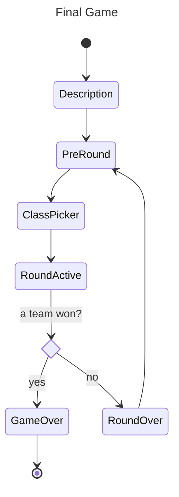

```mermaid
---
title: Final Game
---
stateDiagram-v2
    [*] --> Description
    Description --> PreRound
    PreRound --> ClassPicker
    ClassPicker --> RoundActive
    state has_winner <<choice>>
    RoundActive --> has_winner: a team won?
    has_winner --> GameOver: yes
    has_winner --> RoundOver: no
    RoundOver --> PreRound
    GameOver --> [*]
```
