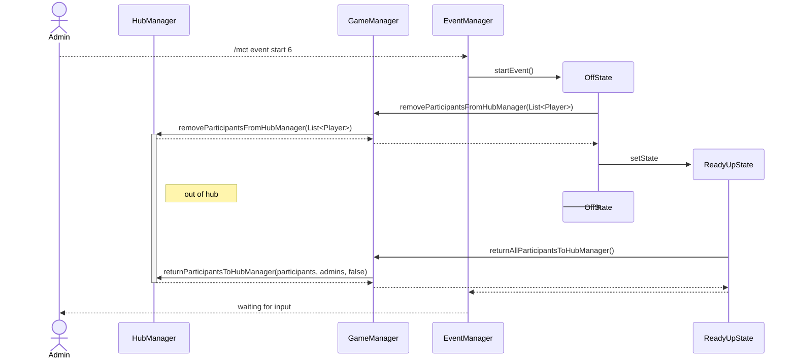
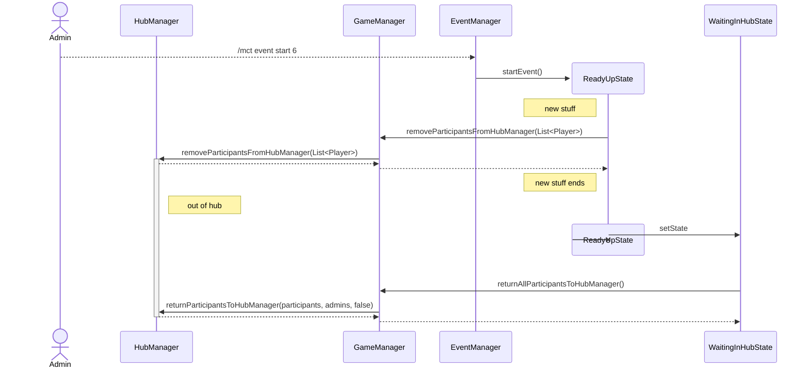

This is a description of the process by which players are removed from the Hub mid-event

## State machine event flow

```mermaid
sequenceDiagram
actor Admin
participant HubManager
participant GameManager
participant EventManager

Admin-->>EventManager: /mct event start 6
create participant OffState
EventManager->>OffState: startEvent()
OffState->>GameManager: removeParticipantsFromHubManager(List<Player>)
GameManager->>+HubManager: removeParticipantsFromHubManager(List<Player>)
HubManager-->>GameManager: 
GameManager-->>OffState: 
create participant ReadyUpState
OffState->>ReadyUpState: setState
Note right of HubManager: out of hub
destroy OffState
OffState-xOffState: 
ReadyUpState->>GameManager: returnAllParticipantsToHubManager()
GameManager->>HubManager: returnParticipantsToHubManager(participants, admins, false)
HubManager-->>-GameManager: 
GameManager-->>ReadyUpState: 
ReadyUpState-->>EventManager: 
EventManager-->>Admin: waiting for input
```

## After ready up

```mermaid
sequenceDiagram
actor Admin
participant HubManager
participant GameManager
participant EventManager

Admin-->>EventManager: /mct event start 6
create participant ReadyUpState
EventManager->>ReadyUpState: startEvent()

Note left of ReadyUpState: new stuff
ReadyUpState->>GameManager: removeParticipantsFromHubManager(List<Player>)
GameManager->>+HubManager: removeParticipantsFromHubManager(List<Player>)
HubManager-->>GameManager: 
GameManager-->>ReadyUpState: 
Note left of ReadyUpState: new stuff ends

create participant WaitingInHubState
Note right of HubManager: out of hub
ReadyUpState->>WaitingInHubState: setState
destroy ReadyUpState
ReadyUpState-xReadyUpState: 
WaitingInHubState->>GameManager: returnAllParticipantsToHubManager()
GameManager->>HubManager: returnParticipantsToHubManager(participants, admins, false)
HubManager-->>-GameManager: 
GameManager-->>WaitingInHubState: 

```
